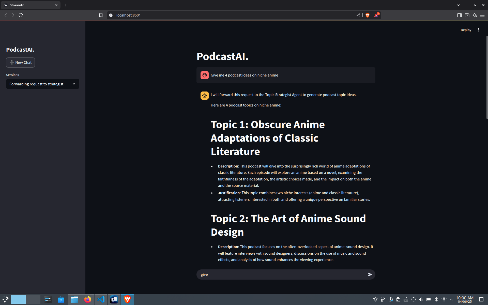
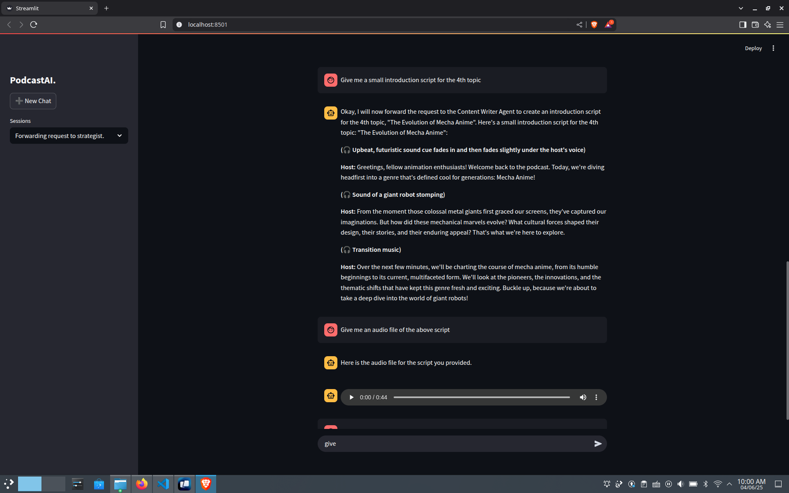

# PodcastTeamAI
PodcastTeamAI is a **multi-agent AI podcast production team**. Built using [Agno](https://www.agno.com/)

**PodcastTeamAI** is capable of:
- Recommend podcast topics based on a prompt.
- Write an entire podcast script for the required podcast topic.
- Convert the podcast text into an audio file.
- Provide captions for social media about the podcast.

There are 4 different agents that does the above jobs respectfully. Each agent has its own respective tools such as **Reasoning Tools**, **Google Search Tools**, **Newspapaer Reading Tools**, **Voice Tools** etc. to achieve the above tasks.

The web interface is built using [Streamlit](https://streamlit.io)

## Screenshots

